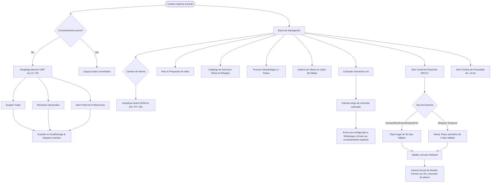

# APP FLOW - Flujo de Navegación y Estados del Sistema

```mermaid
flowchart TD
    UserArrival([Usuario ingresa al portal]) --> CMPCheck{Consentimiento previo?}
    CMPCheck -- No --> ShowCMPBanner[Despliega Banner CMP Ley 21.719]
    CMPCheck -- Yes --> LoadServices[Carga scripts consentidos]

    ShowCMPBanner --> AcceptAll[Aceptar Todas]
    ShowCMPBanner --> RejectNonEssential[Rechazar Opcionales]
    ShowCMPBanner --> ConfigModal[Abrir Panel de Preferencias]
    
    AcceptAll --> SaveConsent[Guardar en localStorage & Disparar eventos]
    RejectNonEssential --> SaveConsent
    ConfigModal --> SaveConsent

    UserArrival --> NavMenu[Barra de Navegación]
    NavMenu --> LangSwitch{Cambio de Idioma}
    LangSwitch --> UpdateDOM[Actualizar textos DOM en ES / PT / EN]

    NavMenu --> ViewHero[Hero & Propuesta de Valor]
    NavMenu --> ViewServices[Catálogo de Servicios Obras & Refugios]
    NavMenu --> ViewProcess[Proceso Metodológico 4 Pasos]
    NavMenu --> ViewPortfolio[Galería de Obras en Cajón del Maipo]
    NavMenu --> ViewCotizador[Cotizador Interactivo m2]
    
    ViewCotizador --> Calculate[Calcula rango de inversión estimado]
    Calculate --> SubmitQuote[Envío pre-configurado a WhatsApp o Email con consentimiento explícito]

    NavMenu --> OpenARCO[Abrir Canal de Derechos ARCO+]
    OpenARCO --> SelectRight{Tipo de Derecho}
    SelectRight -- Bloqueo Temporal --> FastTrack[Alerta: Plazo prioritario de 2 días hábiles]
    SelectRight -- Acceso/Rect/Cancel/Opos/Port --> StandardTrack[Plazo legal de 30 días hábiles]
    StandardTrack --> SubmitARCO[Validar y Enviar Solicitud]
    FastTrack --> SubmitARCO
    SubmitARCO --> ReceiptModal[Genera Acuse de Recibo Formal con ID y resumen de plazos]

    NavMenu --> OpenPrivacy[Abrir Política de Privacidad Art. 14 ter]
```
